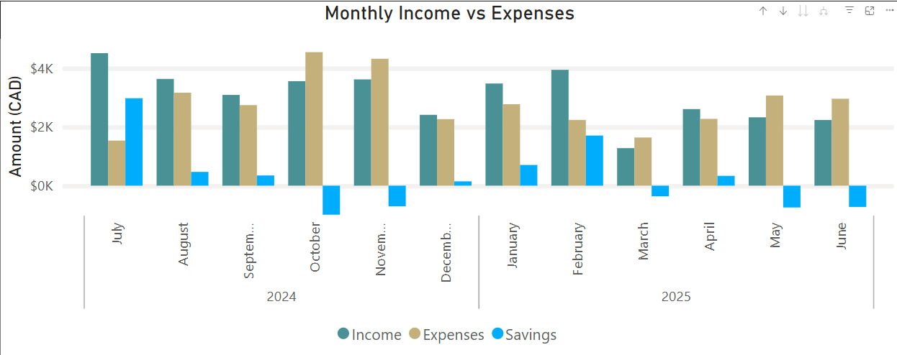
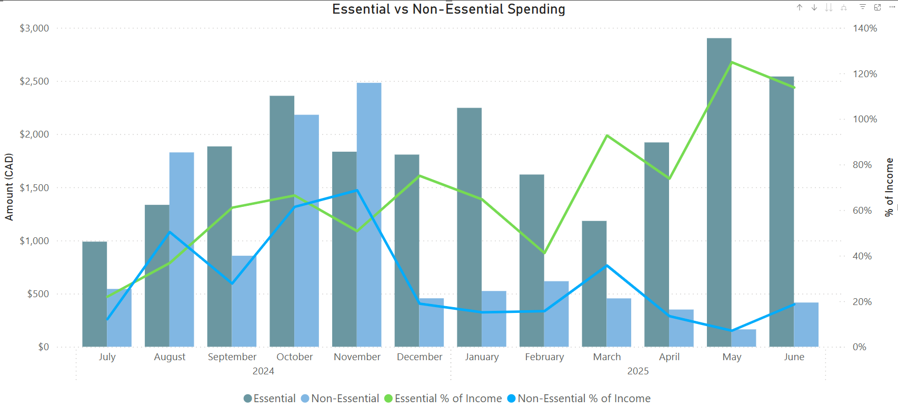
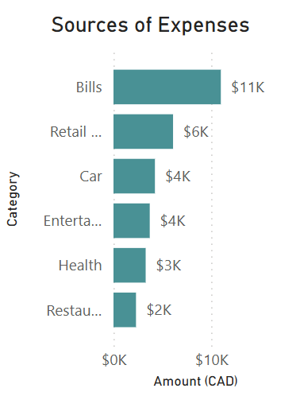
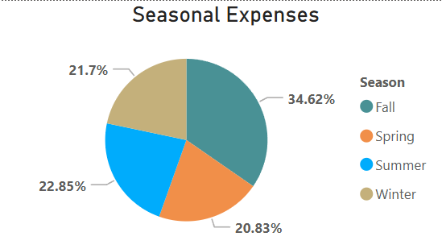
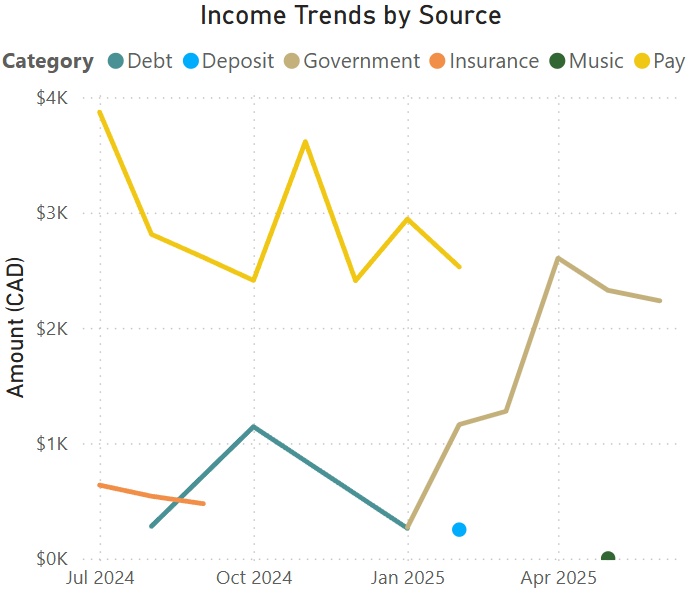

# Overview

This Financial Budgeting Dashboard Project focuses on analyzing and optimizing 2024/2025 personal financial data through a structured approach encompassing data cleaning, exploratory data analysis (EDA), and interactive visualization. The initial phase involves meticulously preparing raw financial data by backing it up, refining columns, handling missing values, and ensuring data consistency. Subsequently, the EDA phase delves into the cleaned data to extract key insights, such as total and average monthly financials, essential versus non-essential expense breakdowns, and spending trends, aiming to pinpoint major spending areas and potential savings. Finally, a Personal Budgeting Dashboard consolidates these findings into actionable visualizations, showcasing income, expenses, savings, and key spending categories to empower informed budgeting decisions.


# The Questions

Below are the questions I want to answer in my project:

1. What are the monthly trends in income and expenses, including the overall savings rate, and were there any months where expenses resulted in a deficit?
2. What percentage of the monthly income goes to essential vs non-essential spending?
3. What are the top 5 overall expense categories? How does spending differ within sub-categories, and do any seasonal patterns emerge in expenditures?
4. How do average weekly expenses look over time?
5. What are the various sources of income, and how consistent are they, specifically identifying any irregular or declining contributions?


# Tools I used

For my deep dive into the financial budgeting data, I harnessed the power of several key tools:

- **SQL**: The main analysis tool used to clean and analyze the data. I used the following SQL techniques:
  - **CTE's**
  - **Window Functions**
  - **Date and Time Functions**
  - **Conditional Logic**
  - **Data Type Conversion and String Manipulation**
  - **Table Operations and Schema Definitions**
  - **Joins**

 - **Power BI**: Served as the primary tool for data visualization.
    - **Data Loading from Sources**
    - **DAX**
    - **Power Query**
    - **Data Modeling**
    - **Slicers**
    - **Drill-Downs/Drill-Through**
    - **Interactive Visualizations**


# Data Preparation and Cleanup
This section outlines the steps taken to prepare the data for analysis, ensuring accuracy and usability.

## Import & Clean Up Data

The data cleaning process was crucial for ensuring the accuracy and usability of the financial data, involving several key steps across both the expense and income datasets. It began by creating backup tables for both expenses (oexpenses from my finances) and income (income2 from income) to preserve the original raw data.

For a comprehensive, in-depth view of the cleaning process, including detailed SQL code, please refer to the provided link: [Financial Budgeting Dashboard (Cleaning)](Financial_Budgeting_Dashboard_(Cleaning).sql)

### Created backup tables

* Created Backup Tables: To work safely without altering the original raw data, duplicate tables were created for both 'my finances' (aliased as expenses) and income (aliased as income2). This involved dropping the tables if they already existed, then creating new tables with the same structure and inserting all data from the originals.

```SQL
drop table if exists expenses;

create table expenses
like `my finances`;

insert into expenses
select * from `my finances`;
```
```SQL
drop table if exists income2;

create table income2
like income;

insert into income2
select * from income;
```

## Cleaning the "expenses" table

For the expenses table, critical steps included: 
* Removing irrelevant header and footer rows
* Renaming generic columns to descriptive names like date, category, and amount
* Replacing blank values with NULL for consistency
* Meticulously converting the date and amount columns to proper DATE and DECIMAL(10,2) data types respectively, which involved removing symbols like '$' and ','.
* Standardized transaction descriptions using a temporary mapping table to ensure consistent naming for recurring purchases.
* Added Primary Key: An id column with AUTO_INCREMENT and PRIMARY KEY constraints was added to 'oexpenses'.
* Reordered the expenses table to have the ID column match the dates and renamed it 'oexpenses'.
  * This is the table that was used for EDA moving forward.

## Cleaning the "income2" table

Similarly, the income2 table underwent essential cleaning which involved: 
* Renaming columns
* Removing irrelevant rows (such as 'Total Income' and 'Net Total')
* Converting the amount to DECIMAL(10,2)
* Transforming the date column into a proper DATE format
* Added Primary Key: An id column with AUTO_INCREMENT and PRIMARY KEY constraints was added to income2.


# The Analysis

Each question addressed in this project is documented and explained in detail within the Financial Budgeting Project (EDA) file. A concise summary of the analytical approach taken to answer each question is provided below.

## 1. What are the monthly trends in income and expenses, including the overall savings rate, and were there any months where expenditures resulted in a deficit?

To analyze trends in monthly income, expenses, and savings, I used SQL to create summary tables for each month’s total income and total spending. These were joined to calculate monthly savings (income minus expenses), allowing me to identify months with surpluses or deficits. I also included average income and spending across all months to better understand how each month compared to overall financial trends.

View my SQL file with detailed steps here: [Financial Budgeting Dashboard (EDA)](Financial_Budgeting_Dashboard_(EDA).sql)

### Visualize Data
```SQL
with monthly_spending as (
select date_format(transdate, '%Y-%m') as month,
sum(amount) as spending
from oexpenses
group by month),

monthly_income as (
select date_format(date, '%Y-%m') as month,
sum(amount) as earnings
from income2
group by month)

select s.month,
 spending, 
 round(avg(spending) over () ,2) as average_spending, 
 earnings, 
 round(avg(earnings) over () ,2) as average_earnings, 
 earnings-spending as 'savings'
from monthly_spending s
join monthly_income i
on i.month = s.month
order by month;
```

### Results


*Bar CHart visualizing the monthly trend of income, expenses, and savings*

### Insights

* **Income fluctuations:** Income peaked in July 2024 (33.47% above average) due to insurance reimbursements and a likely bonus or overtime. November 2024 also exceeded average income by 24.64%, while months like October and December 2024 fell significantly below average (−16.85% and −16.93%, respectively), indicating financial volatility across the period.

* **Expense patterns and deficits:** October and November 2024 saw the highest spending, driven by major one-time purchases (e.g., clothing, gifts, music-related costs) and inconsistent rent inclusion. October, in particular, resulted in a large deficit due to high expenses and one of the lowest monthly incomes, highlighting a misalignment between earnings and outflows.

* **Impact of unemployment:** A drop in income in early 2025, combined with the appearance of Employment Insurance (EI), suggests job loss. Although March showed spending restraint, other months during this period did not reflect significant cutbacks, with elevated expenses contributing to sustained deficits despite reduced income.

* **Savings behavior:** The seven months with below-average spending generally coincided with months where savings were recorded. July 2024 saw the largest savings due to both increased income and moderate spending. However, October and early 2025 emphasize the financial strain caused when spending fails to adjust in tandem with declining income.


## 2. What percentage of the monthly income goes to essential vs non-essential spending?

To assess how income was distributed between essential and non-essential spending, I used SQL to calculate monthly income and categorize expenses accordingly. I then compared each spending type to total income to find their respective percentages, giving a clear view of monthly budgeting priorities.

View my SQL file with detailed steps here: [Financial Budgeting Dashboard (EDA)](Financial_Budgeting_Dashboard_(EDA).sql)

### Visualize Data
```SQL
with monthly_income as 
(
	select
		date_format(date, '%Y-%m') as month,
        sum(amount) as income
	from income2
    group by month
    ),

monthly_non_essentials as (
select
	date_format(transdate, '%Y-%m') as month, 
    sum(amount) as non_essential_spending
from expenses
where NOT (category IN ('Health', 'Car', 'Home', 'Transportation', 'Bills', 'Financial Institution', 'Visa') OR `sub-category` = 'Grocery')
group by month
),

monthly_essentials as (
select
		date_format(transdate, '%Y-%m') as month, 
        sum(amount) as essential_spending
        from expenses
		where category in ('Health', 'Car', 'Home', 'Transportation', 'Bills', 'Financial Institution', 'Visa') or `sub-category` = 'Grocery'
group by month
)
select
    i.month,
    i.income,
    ne.non_essential_spending,
    e.essential_spending,
    ROUND((ne.non_essential_spending / i.income) * 100, 2) AS non_essential_percentage,
    ROUND((e.essential_spending / i.income) * 100, 2) AS essential_percentage,
    ROUND(((IFNULL(ne.non_essential_spending, 0) + IFNULL(e.essential_spending, 0)) / i.income) * 100, 2) AS total_spending_percentage
FROM monthly_income i
LEFT JOIN monthly_non_essentials ne 
ON i.month = ne.month
left join monthly_essentials e
on i.month = e.month
ORDER BY i.month;
```

### Results



*Line and clustered column chart visualizing the monthly percentage of essential and non-essential spending compared to monthly income*

### Insights
* **On average, approximately 27.46% of your monthly income goes towards non-essential spending.**
* **On average, approximately 72.28% of your monthly income goes towards essential spending.**

* Non-Essential Spending Fluctuations:
	* Non-essential spending percentage varies widely from low (~7% in May 2025) to very high (~61% in October 2024), suggesting irregular discretionary spending patterns. Peaks in non-essential spending coincide with high overall spending months.

* Essential Spending Consistently High:
 	* Essential spending percentage often represents a large share of income, regularly above 60% after September 2024. Some months exceed 100% (May, June 2025), showing essential expenses alone are greater than monthly income, which may signal financial stress or misclassification.


## 3. What are the top 5 overall expense categories? How does spending differ within sub-categories, and do any seasonal patterns emerge in expenditures?

To answer the question, I first used a query to identify the top 5 expense categories by total spending. Then, I analyzed sub-categories by comparing their total and average monthly expenditures to estimate expected yearly spending and detect variances. Lastly, I used seasonal groupings based on transaction dates to assess total spend, transaction counts, and average transaction sizes across seasons, revealing spending patterns over the year.

View my SQL file with detailed steps here: [Financial Budgeting Dashboard (EDA)](Financial_Budgeting_Dashboard_(EDA).sql)

### Visualize Data
```SQL
select 
	category, 
	sum(amount) as total 
from 
	oexpenses 
group by 
	category 
    order by 
		total desc
limit 5;
```

### Results



*Horizontal bar chart visualizing the Top 6 highest expenses*





*Pie chart visualizing the distribution of expenses per season*

### Insights
* Top spending categories were Bills, Retail and Grocery, Car, Entertainment, and Health, indicating essential and lifestyle-related expenses dominate the budget.
* Sub-category analysis revealed overspending in areas like Maintenance, Music, and Eating Out, while categories like Rent and Phone showed under or stable spending relative to expectations.
* Seasonal patterns emerged, with Fall showing the highest total spend and transaction volume—suggesting increased costs from events or holidays—while Summer had more frequent but smaller purchases.
* Spending behavior varies significantly, with some categories reflecting consistent, planned expenses and others showing irregular or seasonal spikes, highlighting areas for budgeting improvement.


## 4. How do average weekly expenses look over time?

To understand how average weekly expenses changed over time, I used a SQL query that first assigned each transaction to its corresponding week by calculating the week number and the Monday of that week. Then, I grouped all transactions by year and week, calculating both the total and average amount spent in each week. This allowed me to observe spending trends week by week, identify spikes or dips, and evaluate how consistent or volatile my weekly expenses were throughout the year.

View my SQL file with detailed steps here: [Financial Budgeting Dashboard (EDA)](Financial_Budgeting_Dashboard_(EDA).sql)

### Visualize Data
```SQL
SELECT
  year,
  week_number,
  week_start,
  DATE_ADD(week_start, INTERVAL 6 DAY) AS week_end,
  CONCAT(
    DATE_FORMAT(week_start, '%Y-%m-%d'),
    ' - ',
    DATE_FORMAT(DATE_ADD(week_start, INTERVAL 6 DAY), '%Y-%m-%d')
  ) AS week_range,
  SUM(amount) AS total_spent,
  AVG(amount) AS avg_spent
FROM (
  SELECT 
    YEAR(transdate) AS year,
    WEEK(transdate, 1) AS week_number,
    DATE_SUB(transdate, INTERVAL WEEKDAY(transdate) DAY) AS week_start,
    amount
  FROM oexpenses
) AS derived
GROUP BY year, week_number, week_start
ORDER BY year, week_number;
```

### Insights

* Spending fluctuates significantly week to week, with some weeks like Week 48 (Nov 25–Dec 1, 2024) and Week 40 (Sep 30–Oct 6, 2024) showing exceptionally high totals over $1,900, while others like Week 52 (Dec 23–29, 2024) are under $100.

* The most expensive weeks overall include:

	* Week 48 (2024/11/25 - 2024/12-01): $2,027.65

	* Week 40 (2024/09/30 - 2024/10/06): $1,960.89

	* Week 5 (2025/01/27 - 2025/02/02): $1,789.87

	* Week 24 (2025/06/09 - 2025/06/15): $1,536.93

	* Week 23 (2025/06-02 - 2025/06/08): $1,350.03
   
* These weeks likely involve major events, bills, or one-time purchases.

* Late summer and fall (weeks 32–44) show generally higher and more consistent spending, suggesting increased activity during this period—possibly related to back-to-school or seasonal events.

* Early winter (weeks 50–52) shows a steep drop in spending, despite the holiday season, which could indicate pre-holiday bulk purchases or a spending pause.

* 2025 has had several high-spending spikes (e.g., Weeks 5, 14, 19, 23–24), but also consistent low-spending weeks, pointing to an irregular but recoverable financial rhythm.

* The highest single average daily spending occurred in Week 1 of 2025 ($524.50), suggesting a large, concentrated expense—possibly rent, travel, or a lump payment.


## 5. What are the various sources of income, and how consistent are they, specifically identifying any irregular or declining contributions?

To answer the question about income sources and their consistency, I began by reviewing all entries in the income2 table to understand the full scope of income data. I used aggregation queries to identify the total amount received by each main income category (e.g., Pay, Government, Debt) and then drilled down further into sub-categories, especially within Government payments, to detect patterns or irregularities. I filtered the data by individual categories—Pay, Government, and Debt—to examine trends over time, such as whether contributions were regular, sporadic, or declining. This approach helped reveal which income streams were steady (like Pay) and which were more irregular or seasonal (like Debt or certain Government sub-categories).

View my SQL file with detailed steps here: [Financial Budgeting Dashboard (EDA)](Financial_Budgeting_Dashboard_(EDA).sql)

### Visualize Data
```SQL
select * from income2;
select category, sum(amount) from income2 group by category;
select `sub-category`, sum(amount) from income2 where category = 'Government' group by `sub-category`;

select * from income2 where category = 'Pay';
select * from income2 where category = 'Government';
select * from income2 where category = 'Debt';
```

### Results




*Line graph visualizing the income trends by source*

### Insights

* The primary income source was salary, totaling $23,198.69 over 12 months, with July ($2,464.83) and February ($2,528.28) as the highest months.

* The July salary increase likely came from overtime or bonuses, while February’s spike possibly reflects severance pay, marking the final payment.

* Government payments, mainly Employment Insurance (EI), became regular after the final salary in February, with other irregular government income also noted.

* Debt-related income was the third largest source, sporadic in nature, usually between $100-$150, with occasional larger amounts, likely tied to routine financial management.


# What I learned
Throughout this project, I deepened my understanding of practical data analysis workflows applied specifically to financial budgeting data, and significantly enhanced my technical skills, particularly in SQL and Power BI. Here are a few specific things I learned:


* **I applied rigorous data cleaning methodologies:** I encountered firsthand the complexity of raw financial data and implemented systematic cleaning processes—handling nulls, standardizing date formats, and normalizing descriptions—to ensure the integrity and reliability of downstream analysis.

* **I deepened my financial domain understanding:** Through detailed classification and trend analysis of income and expenditures, I sharpened my ability to identify financial behavior patterns, improve categorization logic, and draw meaningful insights from personal finance data.

* **I generated actionable budgeting insights:** By segmenting spending into essential and non-essential categories, I identified high-cost drivers, seasonal trends, and opportunities for optimization—enhancing both the analytical value and practical application of the findings.
  
* **I conducted diagnostic analysis to assess financial health:** I tracked fluctuations in income and expenditure over time to reveal periods of volatility, surplus, or strain—enabling me to pinpoint underlying causes and inform more resilient budgeting strategies.
  
* **I leveraged advanced SQL for complex analytical tasks:** I utilized CTEs for query modularity, window functions for comparative metrics, and CASE logic for dynamic categorization, demonstrating fluency in scalable and interpretable SQL workflows.
  
* **I emphasized data storytelling through visualization strategy:** While the analysis was conducted in SQL, I recognized the strategic value of tools like Power BI in translating raw data into intuitive visuals that accelerate stakeholder understanding and decision-making.
  
* **I executed a structured, end-to-end data workflow:** From ingestion and cleaning to exploration and insight generation, I followed a disciplined analytics pipeline that mirrors professional data project standards and supports repeatability and scalability.

# Insights

This project provided several valuable insights into the individual’s financial behavior:

* **Income Volatility and Job Loss Indicators:** Income varied significantly month-to-month, with peaks due to insurance payouts or bonuses (e.g., July, November 2024), and sharp declines in October and December. The sudden appearance of Employment Insurance in 2025, combined with a salary stop in February, strongly indicates job loss and financial transition.
* **Persistent Spending Despite Income Drops:** Even after the loss of regular salary, many months in 2025 did not reflect major spending reductions. Essential expenses alone often exceeded income (especially in May and June), suggesting either financial strain or a lack of rapid adjustment to the new financial reality.
* **Discretionary Spending is Irregular and Often High:** Non-essential spending ranged from a low of 7% to over 60% of income, with spikes aligning to months like October 2024—indicating impulsive or event-driven purchases that can derail budget plans.
* **Seasonal Trends in Expenditure:** Fall consistently had the highest total spending and transaction volume, suggesting seasonal factors such as holidays, events, or back-to-school drove up costs. In contrast, early winter spending dipped sharply, perhaps due to pre-holiday bulk purchases or cutbacks.
* **Category and Sub-Category Trends:** The top expense areas were a mix of essentials (e.g., Bills, Car, Health) and lifestyle (e.g., Entertainment, Retail & Grocery). Sub-categories like Maintenance, Music, and Eating Out showed clear overspending, while others like Rent remained consistent or were under-allocated—indicating mixed financial discipline.

# Challenges I Faced

This project was not without its challenges, but each obstacle provided valuable learning opportunities that strengthened both my technical and analytical skills:

* **Data Inconsistencies**: Handling missing, duplicated, or inconsistent entries required careful attention and thorough data-cleaning techniques to maintain the integrity of the analysis.

* **Complex Data Visualization:** Translating multi-dimensional financial data into clear, engaging visuals was a key challenge. Balancing accuracy with clarity required careful selection of chart types, aggregation levels, and formatting to ensure insights were both digestible and actionable.

* **Balancing Breadth and Depth:** Navigating the trade-off between detailed analysis and a comprehensive overview required constant judgment. I had to ensure each deep dive added value without losing sight of broader financial patterns or overlooking key trends.

* **Complex SQL querying and logic**: I utilized advanced SQL features such as CTEs, window functions, and CASE statements to perform intricate calculations and data classifications. Precision in these queries was crucial for correct results.

* **Defining Financial Categories Requires Assumptions:** Since spending priorities vary by individual, I had to apply generalized assumptions to distinguish between essential and non-essential expenses. This classification was based on typical needs and transaction context, but personal interpretation may lead to different categorizations.
# Conclusion

This financial budgeting project successfully provided a comprehensive analysis of personal financial data from 2024 to 2025, offering invaluable insights into income trends, spending habits, and overall financial health. Through meticulous data cleaning and sophisticated SQL-based exploratory data analysis, it became clear how critical data accuracy is for reliable insights. The project illuminated monthly cash flow dynamics, distinguished between essential and non-essential expenditures, and crucially identified periods of deficit where spending outpaced income. Ultimately, this endeavor showcased the power of data analysis in transforming raw financial transactions into actionable intelligence, empowering more informed budgeting decisions and fostering greater financial awareness.
